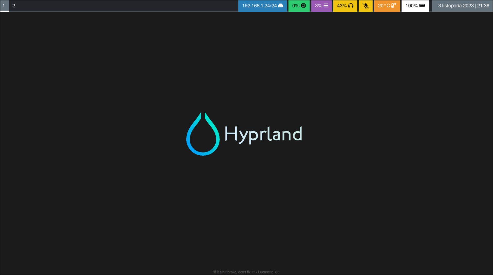

# MyDotHyprland-minimal
This is my absolute minimum to get Hyprland usable. Instalation is based on Arch Linux.  
Some basics how to install Arch Linux you can find here:  
https://github.com/KlapenHz/MyArch


---
### What is Hyprland?

Hyprland is a dynamic tiling Wayland compositor based on wlroots that doesn't sacrifice on its looks.

It supports multiple layouts, fancy effects, has a very flexible IPC model allowing for a lot of customization, a powerful plugin system and more. More information you can find here:

[Hyprland - github page](https://github.com/hyprwm/Hyprland)

---
### Packages

Minimal installation includes:

| Package                     | Description                                                                              |
| ----------                  | ----------                                                                               |
| firefox                     | Web browser                                                                              |
| git                         | Version control system                                                                   |
| gvfs                        | Gnome Virtual File System (Thunar) - support for trash, removable media and more.        |
| hyprland                    | Wayland compositor                                                                       |
| kitty                       | GPU-accelerated terminal emulator                                                        |
| mako                        | Notification deamon                                                                      |
| pavucontrol                 | PulseAudio Volume Control                                                                |
| pipewire                    | Multimedia framework for audio and screensharing                                         |
| polkit-gnome                | Authentication agent                                                                     |
| pulseaudio                  | Network-capable sound server program                                                     |
| pulseaudio-bluetooth        | Bluetooth support for PulseAudio                                                         |
| sof-firmware                | (optional) Additional drivers for sound card                                             |
| thunar                      | File manager                                                                             |
| thunar-archive-plugin       | Plugin which allows you to create and extract archive files using contextual menu items. |
| ttf-font-awesome            | Fonts for waybar                                                                         |
| waybar                      | Status bar                                                                               |
| wireplumber                 | A session and policy manager for PipeWire                                                |
| wofi                        | A rofi inspired launcher for wlroots compositors                                         |
| xdg-desktop-portal-hyprland | Lets other applications communicate through D-Bus.                                       |
---
### Installation:  

Enter the commands below:

```
pacman -Syu
pacman -S hyprland firefox git gvfs kitty mako \
  pavucontrol pipewire polkit-gnome pulseaudio \
  pulseaudio-bluetooth thunar thunar-archive-plugin \
  ttf-font-awesome waybar wireplumber wofi xdg-desktop-portal-hyprland
```

Some dependencies that will install with the above packages and which are worth knowing about:
- polkit
- qt6-base
- qt6-declarative
- qt6-translations
- qt6-wayland

---
### Configuration

Clone the repository:  
`git clone https://github.com/KlapenHz/MyDotHyprland-minimal.git`

Copy the files to `~/.config/hypr/`
```
cd MyDotHyprland-minimal
cp -R .config/* ~/.config/
```
---
### Start hyprland

Run in your terminal command: `Hyprland`

---
### Key bindings

Apps:
```
sup + T         - kitty
sup + Q         - kill active
sup + Shift + M - force to quit from Hyperland
sup + E         - filebrowser (thunar)
sup + V         - togglefloating - allow window to float
sup + D         - app launcher (wofi)
```
Change focus:
```
sup + arrows
```
Workspaces:
```
sup + NUM_1-0    - move active window to workspaces
sup + Shift + NUM{1-0}  - move active container to workspace
sup + scroll     - change workspaces
```
Mouse:
```
sup + LMB - Move window
sup + RMB - Resize windows
```

---
### Optional

- Setting display resolution if needed:

	- Check displays:  
	`hyprctl monitors`

	- If you need to change frequency:  
	`cat /sys/class/drm/card<NUMBER>-<interface>/modes`  
	For more detailed information we need to parse the output:
	```
	sudo pacman -S read-edid
	cat /sys/class/drm/card<NUMBER>-<interface>/edid | parse-edid
	```
	Change display settings in:  
	`~/.config/hypr/hyprland.conf`  
	for example from:  
	`monitor=,preferred,auto,auto`  
	to:
	```
	# monitor = name, resolution position, scale
	monitor = DP-2,     2560x1440@144, 0x0,    1
	monitor = HDMI-A-1, 1920x1080@144, 2560x0, 1
	# workspace = name, number
	workspace = DP-2,     1
	workspace = HDMI-A-1, 2
	```
- Sound settings
	- Check sound card visibility:  
	`pacmd list-cards`  
	If not visible install additional drivers:  
	`pacman -S sof-firmware`

- Waybar additional configuration:
	- Fonts installation:  
	`sudo pacman -S ttf-font-awesome`

	- Manual start:  
	`waybar`

	- Stopping waybar:  
	`killall waybar`

	- Waybar only on one monitor
	Add to the config:  
	`"output": "eDP-1",`
